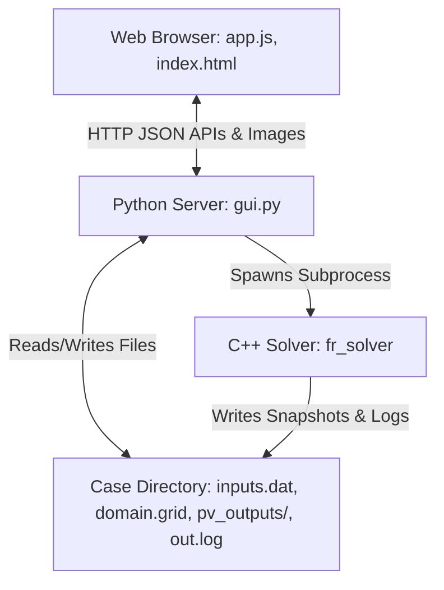

# FR-IGR Web GUI: Technical Architecture & Implementation Overview

This document outlines the architecture, code structure, data flows, and optimization mechanisms of the FR-IGR Web GUI. It serves as a comprehensive developer guide for future modifications and expansions.

---

## 1. Architectural Overview

The Web GUI is structured as a lightweight, two-tier system designed to operate locally (or in WSL) and control the high-order C++ solver:



- **Frontend**: A single-page application built using HTML5, Vanilla CSS, and Vanilla Javascript (`app.js`). It features a dynamic 2D canvas gridding editor and a cached timeline playback visualizer.
- **Backend**: A multi-threaded Python HTTP server (`gui.py`) serving static files and exposing JSON REST APIs. It performs server-side grid validation, parses VTK datasets, and renders contour plots using Matplotlib.

---

## 2. Backend Architecture (`gui.py`)

The backend is written in Python (using standard libraries and `numpy`, `matplotlib`, `xml.etree.ElementTree`) to ensure compatibility inside WSL.

### A. Global Variables and Server Configuration
- `PORT = 8080`: Defines the local server port.
- `CASE_DIR`: Absolute path to the active simulation case folder (passed as a command-line argument).
- `CONTOUR_CACHE`: A global dictionary `{(var_name, vtm_name, mtime): png_bytes}` that caches rendered Matplotlib images in memory to achieve sub-millisecond responses.

### B. Core VTK & XML Parser Functions
- **`fast_parse_vts(vts_path, var_name) -> dict`**:
  Uses regular expressions to quickly scan a VTK XML block file (`.vts` or `.vtu`) without parsing the entire XML DOM tree:
  1. Searches for `WholeExtent` (structured grids) or `NumberOfPoints` (unstructured grids).
  2. Extracts spatial coordinates from `<Points>` and converts the ascii list into a 1D NumPy float array.
  3. Extracts the target field variable (or falls back to `rho`) from `<PointData>` into a NumPy array.
  4. Returns a dictionary containing `x`, `y`, `values`, and `is_structured`.
- **`parse_latest_vts(var_name) -> list`**:
  Uses `xml.etree.ElementTree` to parse the latest `*.pvd` file (checking `plot.pvd` first, then `solution.pvd`). It identifies the latest written `.vtm` dataset, locates its constituent block files, and extracts point coordinates and variables for raw canvas visualization.
- **`generate_contour_plot(var_name, vtm_name) -> bytes`**:
  Generates a high-quality 2D contour plot of the flow field:
  1. Retrieves the VTM file modification time (`mtime`) to check `CONTOUR_CACHE`. If cached, returns the PNG bytes immediately.
  2. Parses all subgrid blocks using `fast_parse_vts`.
  3. Resolves contour settings (colormap, levels, bounds, show-grid) from `.webcontour`.
  4. Plots the blocks: Uses `ax.contourf` for structured grids and `ax.tricontourf` for unstructured grids (e.g. grids around immersed boundaries where nodes inside solids are deleted).
  5. Saves the Matplotlib figure to an in-memory `io.BytesIO` buffer and caches the PNG bytes before returning.

### C. Server Routes & API Handlers (`do_GET` & `do_POST`)
The server inherits from `http.server.BaseHTTPRequestHandler` to process the following endpoints:

#### GET Endpoints
- `/api/config`: Reads `inputs.dat` and `domain.grid` from the case folder, parses them into structured JSON, and returns them to the client.
- `/api/status`: Returns solver state (`running`: True/False), the last 150 lines of `out.log` for console feedback, and arrays of physical diagnostics parsed from `residuals.csv` and `probe.csv`.
- `/api/history`: Parses the current `.pvd` file and returns a list of chronological timesteps, VTM filenames, and their file modification times (`mtime`).
- `/api/contour_image`: Takes `var`, `vtm`, and `mtime` as query parameters. Generates and returns a PNG. If `mtime` is present, writes a long-term cache header (`Cache-Control: public, max-age=31536000`) allowing the browser to cache the file.
- `/api/vts_data`: Exposes raw grid arrays (only used for advanced canvas coordinates mapping).

#### POST Endpoints
- `/api/config`: Receives configuration changes. Runs `validate_config` and updates `inputs.dat` and `domain.grid` locally.
- `/api/run`: Launches the C++ solver subprocess centrally via `run_case.sh` (running in WSL/Linux) with the `-headless` flag to redirect streams to `out.log`. Supports a clean run argument (wipes transient outputs first).
- `/api/stop`: Gracefully terminates the solver by writing a `STOP` file in the case directory.
- `/api/webcontour`: Saves color contour parameters (colormap, limits, grid lines) into `.webcontour`.

#### Helper Methods
- `send_json_response(data, status_code)`: Encodes data as JSON, appends CORS headers, and transmits it.
- `validate_config(inputs, domain) -> (bool, str)`: Performs a strict grid sanity validation (symmetric neighbor boundaries, matching block interface nodes, and parameter type conversions).

---

## 3. Frontend Architecture (`gui/app.js`)

The frontend manages grid layout creation, parameter customization, and visual playback.

### A. Core State Variables
- `blocks`: Stores spatial coordinates, node counts, and boundary conditions for all gridded zones.
- `playbackTimesteps`: Array of `{time, vtm, mtime}` containing the simulation timeline.
- `playbackActiveVtm` / `playbackIndex`: Points to the VTM file of the active playback step.
- `visualizerMode`: Toggles between `grid` (layout designer) and `contour_VAR` (Matplotlib image view).

### B. HTML5 Canvas Grid Designer
- **`draw()`**: Operates the main rendering loop:
  - If in `grid` mode, clears the canvas, loops through `blocks`, and draws block boxes, node density grids, BC boundary lines, and immersed boundary masks (circles, NACA shapes).
  - If in `contour` mode, hides the canvas and displays the `` element, updating its `src` to point to `/api/contour_image`.
- **Coordinate Mapping**: 
  - `mapCoordToCanvas(x, y)` and `mapCanvasToCoord(mx, my)` handle translation between physical grid metrics and screen pixels (handling aspect-ratio matching and vertical viewport flipping).
- **Interactive Mouse Listeners**:
  - `handleMouseDown` / `handleMouseMove` / `handleMouseUp`: Checks cursor coordinates to drag block corners, select boundary faces for editing, or place point probes.

### C. Playback Caching & Preloading Engine
- **`preloadContourImages(varName)`**:
  Performs sequential preloading to eliminate playback lag:
  1. Cancels any ongoing preloading queue by setting a cancel flag.
  2. Iterates through `playbackTimesteps` and instantiates a sequential queue: loads the next image *only* after the current image has finished downloading (or failed).
  3. Image source is constructed as `/api/contour_image?var=${varName}&vtm=${entry.vtm}&mtime=${entry.mtime}`.
  4. This populates the browser's native HTTP cache sequentially without locking connection limits.
- **`fetchPlaybackHistory()`**:
  Queries `/api/history`. Automatically updates the timeline range slider. If a simulation is running, it scales the slider bounds while preserving the user's current timeline position.
- **`updatePlaybackView()`**:
  Triggers a redraw or swaps the visible `contourImg.src` when the user slides, clicks play/pause, or steps through timesteps.

---

## 4. Key Execution Procedures

### A. Saving Layout Changes
```
[Client App] --> Click "Save" --> validate_config() (in Browser) 
                                         |
                       (Symmetry & Metric checks pass)
                                         |
                                         v
[Server] <------- POST /api/config ------+
   |
   +--> validate_config() (Strict backend check)
   +--> Writes domain.grid & inputs.dat
   +--> Returns HTTP 200 Success
```

### B. Dynamic Simulation Loop Polling
Every **1000 milliseconds**, `gui/app.js` runs a status polling loop:
1. Requests `GET /api/status`.
2. Updates solver status indicators ("Idle" vs. "Running").
3. Appends new logs to the terminal log stream box.
4. Draws line charts for L2 residuals and probe histories.
5. If the visualizer is in `contour` mode, it calls `fetchPlaybackHistory()` to update the timeline bounds and prefetch newly written checkpoint files in the background, updating the display instantly.
